# Tablero Kanban

Para la utilización del tablero Kanban se optó por la herramienta ClickUp. Se crearon 4 columnas para clasificar las tareas dependiendo su estado:

- _“To do”_, son las tareas a realizar. Están disponibles para seleccionar por los desarrolladores, quienes deben gestionar la asignación y el estado de la tarea.
- _“In progress”_, son las tareas que están siendo desarrolladas. Cada desarrollador debería tener solo una tarea en este estado.
- _“On hold”_, son las tareas que están bloqueadas por algún motivo. Cuando una tarea está en este estado, debe estar indicado en los comentarios por qué lo está y taggeado quién o quiénes podrían brindar una solución al bloqueo.
- _“Complete”_, son las tareas que ya fueron terminadas.

A continuación se adjuntan imágenes de los diferentes estados del tablero a medida que transcurre la realización del proyecto.

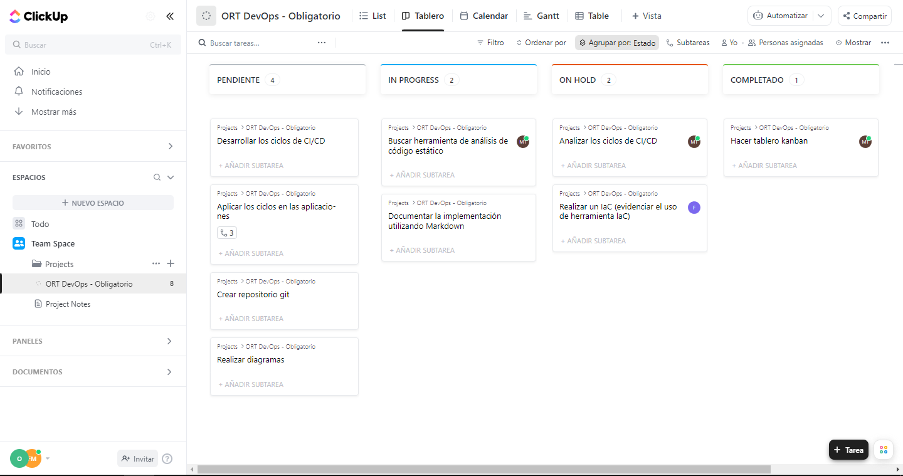
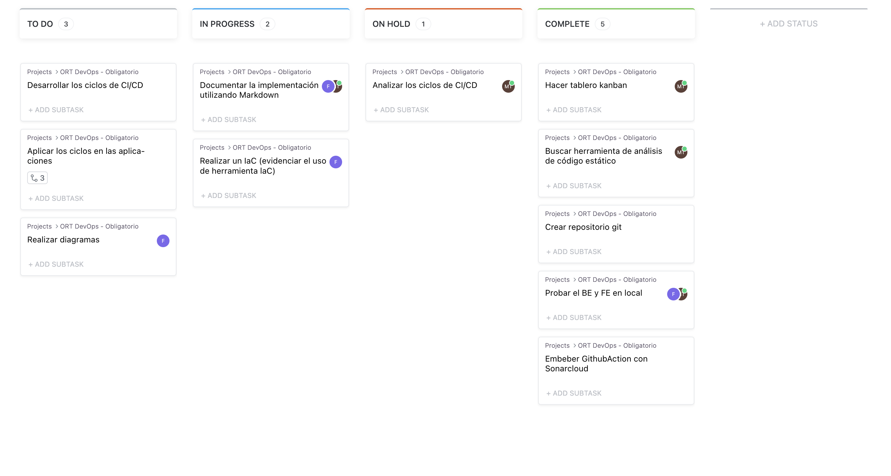

# Análisis ciclos CD/ CI

## Ciclo de CI/CD para el ambiente de Desarrollo (Dev):

- Etapa 1: Desarrollo y Pruebas Locales: Los desarrolladores escriben y prueban el código en sus entornos locales.
- Etapa 2: Integración Continua: El código se integra en un repositorio compartido y se ejecutan pruebas automáticas para asegurar la integridad y la calidad del código.
- Etapa 3: Despliegue en el Ambiente de Desarrollo: Una vez que las pruebas son exitosas, el código se despliega en un entorno de desarrollo compartido donde se puede probar en un contexto más realista.

## Ciclo de CI/CD para el ambiente de Pruebas (Test):

- Etapa 1: Despliegue en el Ambiente de Pruebas: El código aprobado en el ambiente de desarrollo se despliega en un ambiente de pruebas dedicado.
- Etapa 2: Pruebas Automatizadas: Se ejecutan pruebas automatizadas para verificar la funcionalidad, el rendimiento y la compatibilidad del software en el ambiente de pruebas.
- Etapa 3: Pruebas de Aceptación: Se realizan pruebas manuales para validar el software desde la perspectiva del usuario y garantizar que cumpla con los requisitos establecidos.

## Ciclo de CI/CD para el ambiente de Producción (Prod):

- Etapa 1: Despliegue en el Ambiente de Producción: El software aprobado en el ambiente de pruebas se despliega en el ambiente de producción en un entorno controlado.
- Etapa 2: Monitoreo y Operaciones: Se realiza un monitoreo continuo del software en producción para detectar posibles problemas y garantizar un rendimiento óptimo.
- Etapa 3: Actualizaciones y Mantenimiento: Se aplican actualizaciones, correcciones de errores y mejoras en el software en producción de acuerdo con las necesidades del negocio y los requisitos del usuario.

# Por qué usar SonarCloud

SonarCloud es una herramienta de análisis de código estático que permite identificar y solucionar problemas de seguridad, errores, vulnerabilidades y otros problemas de código en general. Además, proporciona mediciones de calidad y complejidad del código fuente. Una de las ventajas significativas de SonarCloud es que es de código abierto, lo que significa que cuenta con una comunidad amplia donde es posible consultar y discutir sobre los problemas encontrados. Esta característica también contribuye a su facilidad de uso, ya que se beneficia de la colaboración y la experiencia colectiva de desarrolladores de todo el mundo.

# Análisis de código estático

En primer lugar se analizó la aplicación de frontend hecha en React.

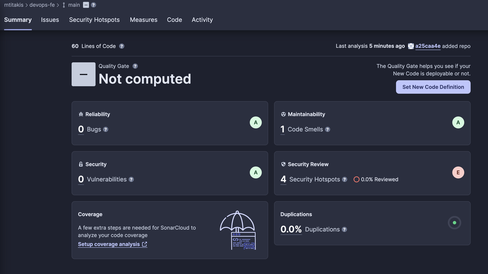

Luego se analizaron las 4 aplicaciones de backend, obteniéndose los siguientes resultados:

Products MS

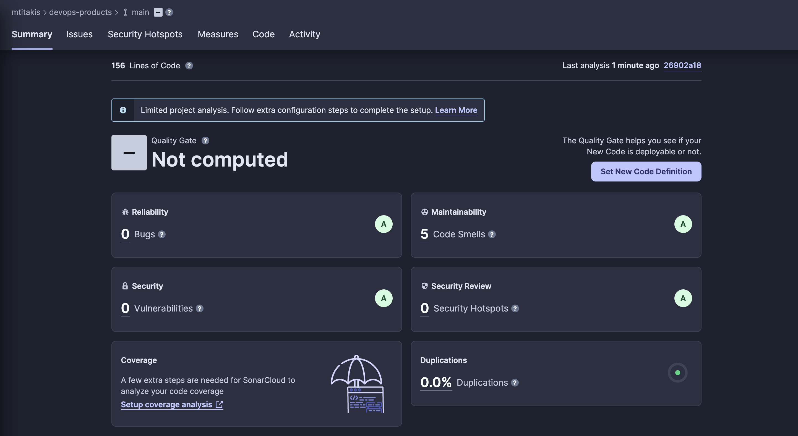

Orders MS

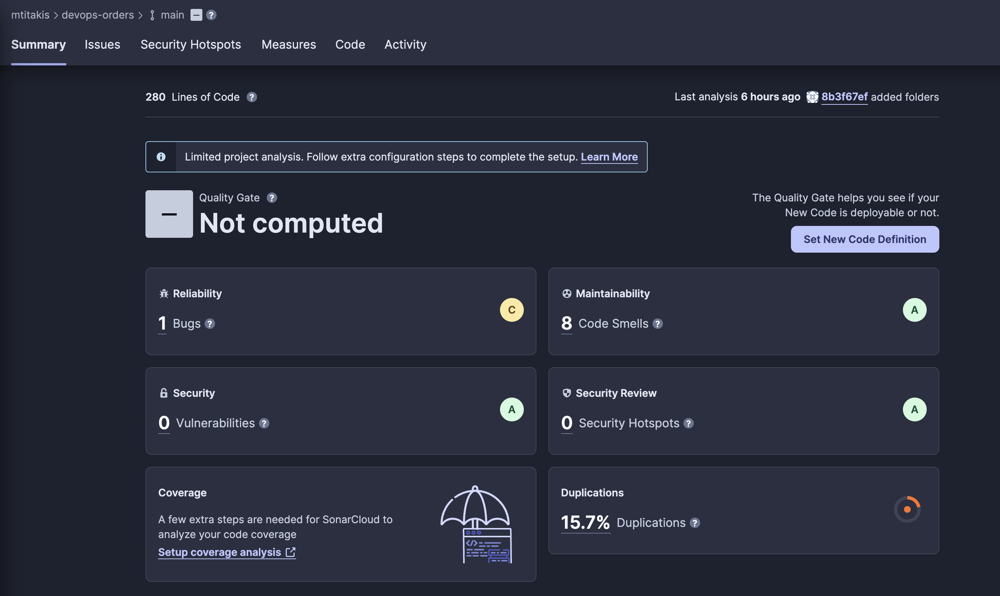

Shipping MS

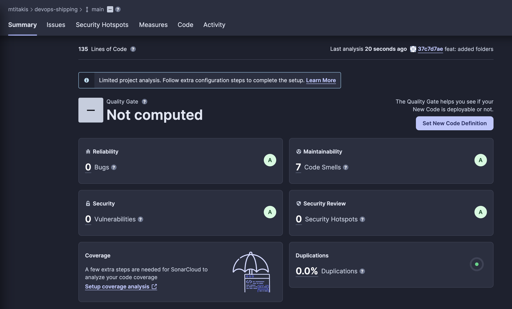

Payments MS

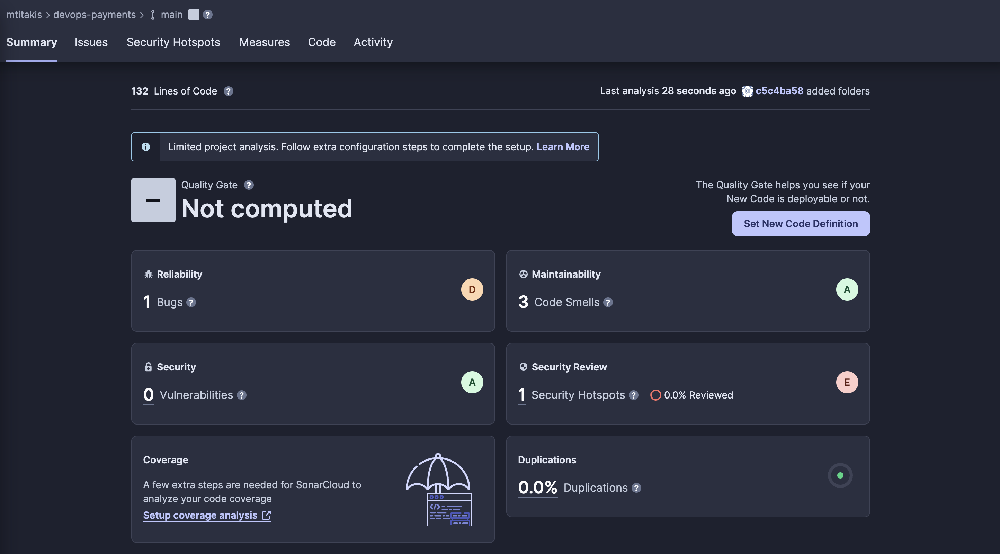

## Informe de calidad de código

Se encontraron varios bugs, code smells y security hotspots. Los bugs detectados reflejan problemas funcionales que podrían afectar la estabilidad y el rendimiento de los sistemas. Por otro lado, los code smells identificados indican posibles debilidades y áreas de mejora en el diseño y la implementación del código. Asimismo, la presencia de diversos security hotspots resalta la necesidad de fortalecer las medidas de seguridad para prevenir posibles vulnerabilidades.

Algunas de las medidas que se podrían tomar para mejorar estos problemas son:

- Establecer un Quality Gate personalizado en SonarCloud con criterios específicos para proyectos listos para producción.
- Realizar tareas de refactorización para abordar los code smells identificados y mejorar la estructura y legibilidad del código.
- Realizar revisiones de código periódicas con el equipo para detectar problemas tempranamente y compartir buenas prácticas.
- Implementar un enfoque de desarrollo seguro con análisis regulares para resolver los security hotspots y prevenir vulnerabilidades.

# Prueba sobre aplicación frontend utilizando Google Lighthouse

Lighthouse es una herramienta de código abierto desarrollada por Google que audita la calidad y rendimiento de aplicaciones web. Proporciona informes detallados en áreas como rendimiento, accesibilidad, mejores prácticas y SEO. Se analizaron las 3 páginas de la aplicación frontend realizada en React: el home, la sección "planets" y la sección "people".

Se obtuvieron los siguientes resultados:

- Home

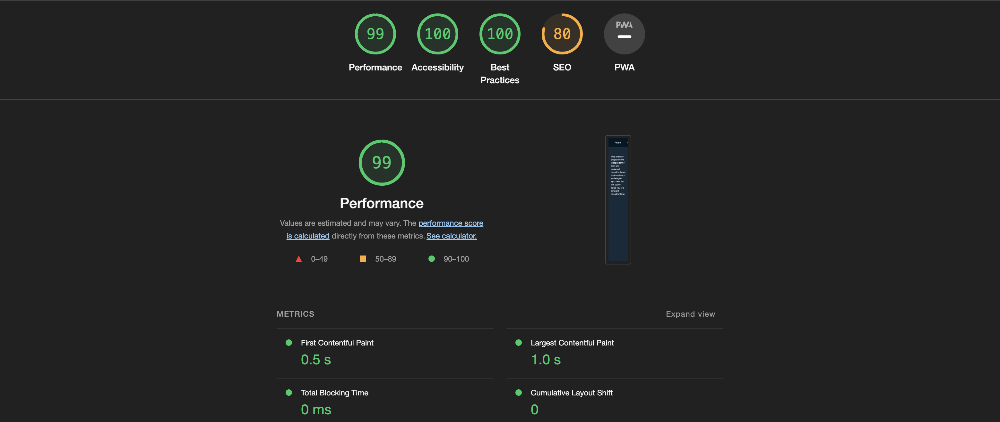

- People

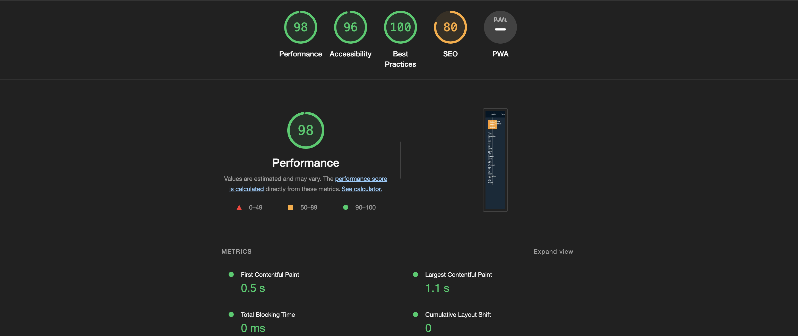

- Planets

Como resultado, se puede decir que la aplicación cumple ampliamente las expectativas de una aplicación frontend en términos de performance, accesibilidad y buenas prácticas. Siendo el SEO el punto a mejorar en las tres secciones de la misma.

Si vamos a la sección de SEO que proporciona lighthouse, podemos ver el siguiente detalle:

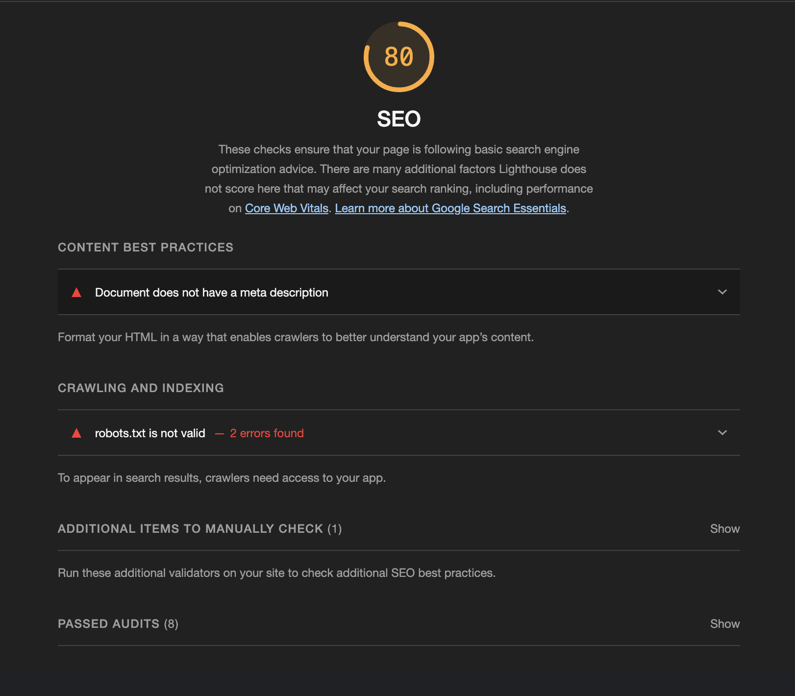

Como se menciona en el reporte, la página no cuenta con un meta description, lo que disminuye considerablemente su SEO. Tambien indica que el archivo robots.txt tiene errores, este archivo es utilizado para comunicar a los motores de búsqueda y otros rastreadores web cómo deben comportarse al acceder y rastrear las páginas.

# Por qué usar Github Action

GitHub Actions es la herramienta que elegimos utilizar para la integración continua (CI) debido a su facilidad de uso y su integración directa en la plataforma de GitHub. Esta característica simplifica la configuración y gestión de los flujos de trabajo. Al estar estrechamente integrado con GitHub, permite una colaboración fluida y un seguimiento de los cambios realizados en el repositorio. Además, GitHub Actions ofrece una amplia variedad de acciones predefinidas y personalizables que facilitan la automatización de tareas comunes en el desarrollo de software.

# Manejo de repositorios y estrategia de ramas

Para el proyecto utilizamos varios repositorios. Uno para cada aplicación de backend y uno para la aplicación de frontend. A su vez tenemos un repositorio en conjunto donde tenemos todos los archivos desarrollados para las etapas de develop y de devops. En el mismo se encuentran todos los archivos solicitados para la entrega final: las imágenes de docker, los archivos de deploy, el readme, los diagramas e imágenes.

## Estrategia de ramas

Para el trabajo de desarrollo utilizamos la estrategia GitFlow, diviendo así nuestro repositorio en tres ramas estables (develop, test, master). A su vez, se crearon ramas efímeras por cada una de las funcionalidades desarrolladas. Por ejemplo, al momento de agregar la imagen de docker del frontend, se creo la branch "feature/fe-docker-image".

A continuación se detalla el diagrama de ramas utilizado:

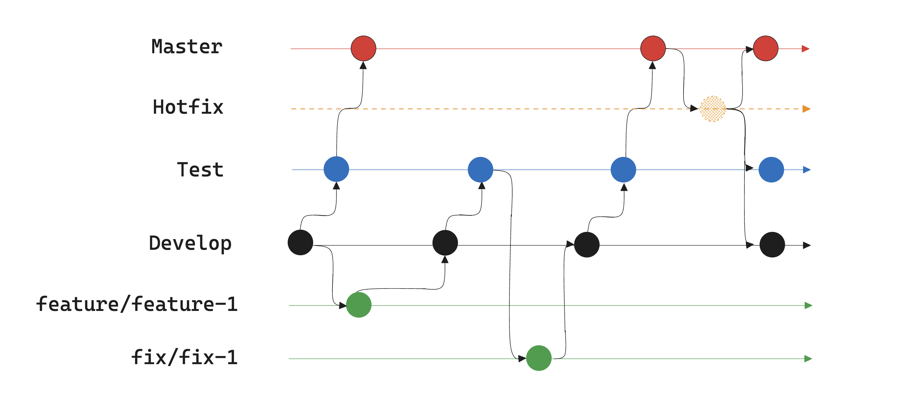

## Diagrama de flujo de CI/CD

Nustro flujo de trabajos dejando de lado el versionado de la aplicacion consta de Test, Build y Deploy. Donde hacemos un test de codigo estatico con la herramienta SonarCloud, para verificar la calidad del codigo.
Luego se hace una Build de la imagen que se aloja en un servicio de AWS, llamado ECR, donde luego se hace el deploy a un cluster de Kubernetes tambien de AWS.

## Solucion de la problematica 

Para este problema el equipo se planteo las siguientes herramientas para poner en practica DevOps:
- Github como control de versionado.
- Terraform como insfraestructura como codigo.
- SonarCloud como testing de codigo estatico.
- AWS como contenedor y deploy de la aplicaciones e imagenes de la misma.
- Github Action como herramienta de workflows.
  
